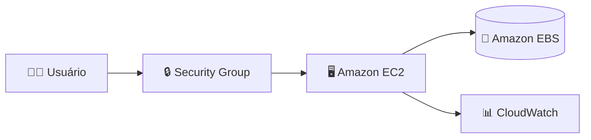

# ☁️ AWS EC2 Lab - Gerenciamento de Instâncias Amazon EC2


---

## 📖 Descrição

Este repositório foi desenvolvido como parte do desafio prático da **DIO (Digital Innovation One)** com foco no gerenciamento de instâncias **Amazon EC2** na AWS.

O laboratório permitiu a criação, configuração, monitoramento e gerenciamento de uma instância EC2, além da utilização de recursos como Security Groups, EBS e CloudWatch.

---

## 🎯 Objetivos de Aprendizagem

* Aplicar conceitos de computação em nuvem.
* Criar e gerenciar instâncias EC2.
* Configurar regras de acesso utilizando Security Groups.
* Utilizar armazenamento persistente com Amazon EBS.
* Monitorar recursos através do Amazon CloudWatch.
* Documentar processos técnicos utilizando GitHub.

---

## 🏗️ Arquitetura do Laboratório



---

## ☁️ Serviços AWS Utilizados

| Serviço         | Descrição                              |
| --------------- | -------------------------------------- |
| Amazon EC2      | Máquina virtual na nuvem               |
| Amazon EBS      | Armazenamento persistente              |
| AWS IAM         | Gerenciamento de usuários e permissões |
| CloudWatch      | Monitoramento e métricas               |
| Security Groups | Controle de acesso à instância         |

---

## 🚀 Etapas Realizadas

### 1️⃣ Criação da Instância EC2

Configurações utilizadas:

* Nome da Instância: AWS-EC2-LAB
* Sistema Operacional: Amazon Linux
* Tipo da Instância: t2.micro
* Região: us-west-2
* Volume EBS padrão

---

### 2️⃣ Criação do Par de Chaves

Configuração utilizada:

* Tipo: RSA
* Formato: .pem

O par de chaves permite acesso seguro à instância via SSH.

---

### 3️⃣ Configuração do Security Group

Portas configuradas:

| Porta | Protocolo | Função             |
| ----- | --------- | ------------------ |
| 22    | SSH       | Acesso remoto      |
| 80    | HTTP      | Aplicações Web     |
| 443   | HTTPS     | Aplicações Seguras |

---

### 4️⃣ Inicialização da Instância

Durante a criação da instância foram executadas as seguintes etapas:

✅ Inicializando solicitações

✅ Criando grupos de segurança

✅ Criando regras do grupo de segurança

✅ Iniciando instância

---

### 5️⃣ Monitoramento

Foi realizado acompanhamento através do Amazon CloudWatch:

* CPU Utilization
* Network In
* Network Out
* Status Checks

---

### 6️⃣ Gerenciamento da Instância

Operações executadas:

* Start
* Stop
* Reboot
* Monitoramento
* Encerramento controlado

---

## 📷 Evidências

As capturas de tela utilizadas neste laboratório estão armazenadas na pasta:

```text
images/
├── cloudwatch-metrics.png
├── EBS.PNG
├── ec2-running.png
├── instaciaInterropida.PNG
└── instance-connect.png
```

---

## 📁 Estrutura do Repositório

```text
aws-ec2-lab/
│
├── README.md
│
└── images/
    ├── cloudwatch-metrics.png
    ├── EBS.PNG
    ├── ec2-running.png
    ├── instaciaInterropida.PNG
    └── instance-connect.png
```

---

## 📚 Conceitos Aprendidos

### Amazon EC2

Serviço responsável pela criação de servidores virtuais sob demanda.

### Amazon EBS

Serviço de armazenamento persistente associado às instâncias EC2.

### Security Groups

Firewall virtual utilizado para controlar o tráfego de entrada e saída.

### Amazon CloudWatch

Serviço de monitoramento e observabilidade da AWS.

### IAM

Serviço utilizado para gerenciamento de usuários, grupos e permissões.

---

## 💡 Insights Obtidos

* A EC2 oferece flexibilidade para criação de ambientes sob demanda.
* Security Groups são fundamentais para a segurança da infraestrutura.
* O CloudWatch permite monitoramento detalhado dos recursos.
* O armazenamento EBS garante persistência dos dados.
* A documentação facilita futuras implementações e consultas.

---

## 🛠️ Tecnologias Utilizadas

* Amazon EC2
* Amazon EBS
* AWS IAM
* Amazon CloudWatch
* Git
* GitHub
* Markdown

---

## 📈 Próximos Passos

* [ ] Configurar Elastic IP
* [ ] Utilizar Auto Scaling
* [ ] Integrar com Amazon S3
* [ ] Automatizar tarefas com AWS CLI
* [ ] Explorar Load Balancers

---

## 👩‍💻 Autora

**Maria Correia**

🎓 Estudante de Tecnologia da Informação - UNIVESP

☁️ AWS Cloud Practitioner (em formação)

💻 Java | Spring Boot | Banco de Dados | AWS

🔗 GitHub: https://github.com/MariaaPcsa

---

## 📜 Licença

Projeto desenvolvido para fins educacionais durante o Bootcamp AWS da DIO.
